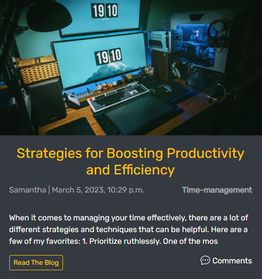
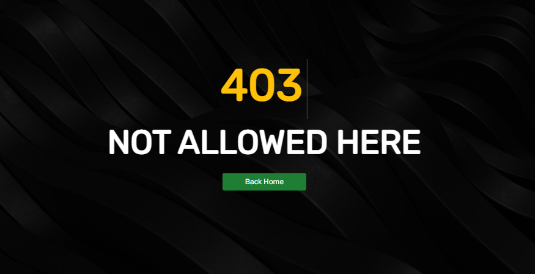
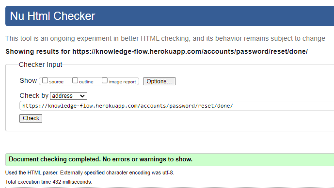
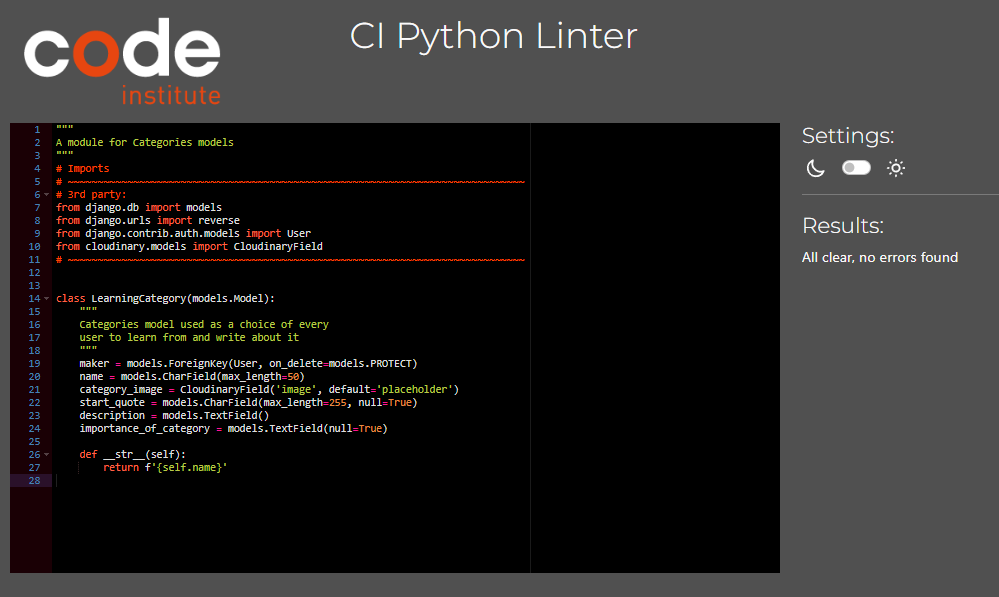

# Knowledge Flow
(Developer: Roman Rakic)

[View live website](https://knowledge-flow.herokuapp.com/)

## Table of Contents
0. [About](#about)
1. [Project Goals](#project-goals)
    1. [User Goals](#user-goals)
2. [User Experience](#user-experience)
    1. [Target Audience](#target-audience)
    2. [User Requirements and Expectations](#user-requirements-and-expectations)
    3. [User Stories](#user-stories)
    4. [Site Owner Stories](#site-owner-stories)
3. [Design](#design)
    1. [Colours](#colours)
    2. [Fonts](#fonts)
    3. [Project Structure](#project-structure)
    4. [Database](#database)
    5. [Data Models](#data-models)
    6. [Wireframes](#wireframes)
    1. [Agile Design](#agile-design)
    2. [CRUD Functionality](#crud-functionality)
4. [Technologies Used](#technologies-used)
    1. [Languages & Frameworks](#languages--frameworks)
    2. [Libraries and Tools](#libraries--tools)
    
5. [Features](#features)
6. [Future implementation](#future-implementation)
    1. [Future Features](#future-features)
7. [Validation](#validation)
    1. [CSS](#css)
    2. [Html](#html)
    3. [Javascript](#javascript-validation)
    4. [Python](#python-validation)
    5. [Chrome Dev Tools Lighthouse](#chrome-dev-tools-lighthouse-validation)
    6. [WAVE Validation](#wave-validation)
8. [Testing](#testing)
    1. [Device Testing](#device-testing)
    2. [Browser Compatibility](#browser-compatibility)
    3. [Manual Testing](#manual-testing)
    4. [Automated Testing](#automated-testing)
9. [Bugs](#bugs)
10. [Configuration](#configuration)
    1. [Google emails](#google-emails)
11. [Deployment](#deployment)
    1. [Heroku](#heroku)
    2. [Forking GitHub Repo](#forking-the-github-repository)
    3. [Clone a GitHub Repo](#clone-a-github-repository)
12. [Credits](#credits)
    1. [Tutorial](#tutorials)
    2. [Code](#code)
    3. [Literature](#literature)
    4. [Misc](#misc)
13. [Acknowledgements](#acknowledgements)

## About

The Knowledge Flow is a Learning and Blogging application that allows users to post blogs  in
a chosen categories add comments, learn from the content of a blog or a comment and find a mentor available 
for each category and reach out and connect with them.

***
## Project Goals
Primary goals of the Project(web app):
- Give users  an online solution to Learn  or Teach 
 in a certain category
- Enable users to express themselves through a written form
in comfort of their environment and provide or get some 
valuable information that will help them or others develop more
knowledge. 
  

### User Goals
- Ability to create content
- Be able to share content and give an opinion on a topic
- Ability to amend and update content
- Chance to connect with a variety of interesting individuals. 

## User Experience

### Target Audience
- People with a desire to teach and share their knowledge
- Individuals that want to learn and expand the knowledge
- People who's wants to be productive and save time while learning 

### User Requirements and Expectations

- Application with a clear purpose
- Easy and intuitive user interface that allows quick and efficient navigation
- Responsive and visually good design
- Engaging content within the limit of set categories
- Way to engage with a team or a developer

##### Back to [top](#table-of-contents)

### User stories

0. As a user I want to navigation to be intuitive and user-friendly so that Im able to easily navigate through the app content.
1. As a  user I want to know Important info on what the app is about so that I can use it's functionality on mutual benefit
2. As an authenticated user I would like to be able to choose a way to get benefit from the app with choosing the right role
3. As an authenticated user I would like to have a full access to the content of an web app
4. As an authenticated user I would like a functionality to create profile(account)
5. As an authenticated user I would like functionality to upload a supporting image to my profile and change it when I desire
6. As an authenticated user I would like a functionality to update or delete profile (account) if not planning to use web app anymore
7. As an authenticated user I would like functionality to pick different types of learning categories in my profile and change them later
8. As an authenticated user I would like functionality to see and read blog posts that other users created
9. As an authenticated user I would like to upload a blog in a selected category so that I can share my knowledge,opinion and informations
10. As an authenticated user I would like functionality to delete or update my blog post i I find it no longer relevant
11. As an authenticated user I would like functionality to leave a comment on a blog post 
12. As an authenticated user I would like functionality to support my blog post with a cover image and change it later if needed.
13. As an authenticated user I would like the functionality for each category page to have a list of mentors avaliable and their contact info
14. As a user I would like web app to be fully responsive and to have the same experience when using
on any device 
15. As an returning user user I would like functionality to set a new password if I forgot the password so that I can still use the web app
16. As a User I would like a Functionality to contact the app owner or a team so that I can leave a suggestion or express my opinion about the web app
17. As a user I would like a Functionality to update or delete a comment I posted to a blogpost so that if any mistake was made or new information is acquired anyone reading will be up to date

### Site Owner Stories

18. As a site owner I want to restrict access to sections of an app to unauthenticated users so that basic standards of data protection are met
19. As a Site Owner I would like that authenticated users have full access to web app and its functionality
20. As a Site Owner I would like that each data entry is validated before stored in database
21. As a Site Owner I would like that users an leave a message or feedback via contact form or 
22. As a Site Owner I would like that users have more than one way of comunicating with team or myself
23. As a Site Owner I would like that each 'Mentor' user cant see himself on the list of available mentors for his respective category(user wont be contacting himself)
24. As a Site Owner I would like that each authenticated user gets prompt messages when performing CRUD(Create,Read,Update,Delete) operations when using web app.
25. As a Site Owner I would like that each authenticated user has option to get access to an app if he forgots password for any reason via (Reset password functionality)

## Design
***
### Colours
Web app is utilizing  dark theme with black and blue colors, it is enhancing user experience by reducing eye strain and improving visibility in low-light environments.

The Color pallet was created using [Coolors.co](https://coolors.co/)

See colour pallet

### Fonts
Google fonts "'Rubik', sans-serif" modern and versatile font were used for this project as it offers  clean and legible design, which makes it easy to read on screens of different sizes and resolutions. It has a neutral appearance and doesn't have any distracting features that can make it difficult to read.

See Rubik font

## Project Structure 

#### Web app  pages
Clean dark theme was used troughout entire project, intuitive and simple navigation and 
clear message about value of knowledge was main driver for delivering the project.

#### sections:
1.  Home page divided into 6 sections with simple and intuitive navigation
- Hero Section with supporting image and clear call to action
- Bottom hero that's going deeper with an hero headline and displays some benefits and ways to use the web app
- Team section that presents members responsible for delivering a fnished project
- About section with a quote
- Contact section  with a simple form and a web app banner
- Footer with some navigation social media links
2. Blog Page where user can see latest blogs posted with links to a more detail vie of each blog
3. Add blog page with a simple form 
4. Profile page where all the data about user is stored
5. 3 Category pages
- Personal finance
- Leadership
- Time management 
- each page consists of headline, supporting image , sections that describes category, describes importance ,benefits and section where user can see available mentors for that category.
then section with blogs related to that category

### Code structure
Project code structure is organized and divided into various application folders and constructed using Django Framework 
#### Project Apps:
- Home app - constructed to deliver basic information for the User about the app via Home page with simple an intuitive navigation(links in nav-bar and footer to navigate throughout app), basic contact form for user feedback and footer

- Siteusers app- this app provide user authentication and profile management functionality,full CRUD functonality, so user can create a an account, select a role that provides further functionality and usage, update profile, upload supporting images for a profile

- flow_blog app - constructed to deliver CRUD functions of a blogging app, where  structure includes the necessary files for running the application, including the views, models, and templates required to create, read, update, and delete blog posts and comments 

- categories app - delivers  functionality for users to select and manage learning categories for their profile and blog posts. The app includes views and templates for displaying a list of available categories and enabling users to select which learning categories they want to be associated with their profile and blog posts. 

#### Other django apps:
- **settings.py**: This file contains configuration settings for your Django project, such as database settings, installed apps, and middleware.
- **Procfile**: This file is used to specify the commands that should be executed when your Django app is deployed on a hosting platform.
- **static**: This directory contains the base CSS and JavaScript files 
- **templates**- base level folder with basic templates extended throughout other templates like : base.html, navbar.html, footer.html, also templates for user authentication and also each app has its own templates folder with html files to support the app functinalit and reusability
- **requirements.txt**: This file lists the dependencies required for  Django project to run.
- **env.py**: This file is used to store environment variables for a Django project or application, such as database connection details or API keys. best practice is including this file into th gitignore file so  the values can be easily accessed and used by the project without being exposed in the code or configuration files.

## Database
***

(ERD)Physical database model

- For this Django app I ve used PostgreSQL relational database management system.
- model showed on the diagram visually represents the structure of a PostgreSQL database, including tables, columns, relationships, and constraints, that is actually stored in the database itself.

### Data Models

#### User model

- User model as part of the Django allauth library contains basic information about authenticated user and contains folowing fields:
username, password,email

#### Profile model

- Profile model is constructed as an extension of  user model  and there for has an <strong>one to one</strong> relationship with User model.also it related via <strong>Many To Many</strong> field with a Learning category model. it contains further data about authenticated user and has following fields: Image,first_name, last_name,email,category,website_url,linkedIn_url,bio,role,created_on,updated_on

#### BlogPost model

- BlogPost model is model used for each blogpost uploaded by the user,it has foreign key to the User model to associate each post with the author who created it, and another foreign key to the Category model to organize posts by topic or theme.By using foreign keys to establish these relationships model is associated with valid users and categories in the system. it consists of the 
following fields:

| Name          | Database Key  | Field Type    | Validation |
| ------------- | ------------- | ------------- | ---------- |
| title        | title      | CharField| max_length=200, unique=True  |
| creator        | creator       |ForeignKey   | User, on_delete=models.CASCADE  |
| category| category  | ForeignKey   | LearningCategory, on_delete=models.PROTECT, null=True     |
|  slug   | slug   | SlugField   | max_length=100, unique=True  |
| body       | body     |TextField |      |
|  cover_image     | cover_image      | CloudinaryField  | 'image', default='placeholder'   |
|  created_on     | created_on      | DateTimeField   | auto_now_add=True    |
|  updated_on     | updated_on      | DateTimeField   | auto_now_add=True    |

#### Comment model

- Comment model is used for any user comment on particular blog post there are 2 foreign keys one associated to a user and the other to a blog post fields of this model are:

| Name          | Database Key  | Field Type    | Validation |
| ------------- | ------------- | ------------- | ---------- |
| author         |  author          | ForeignKey | User, on_delete=models.CASCADE   |
| created        | created       | DateTimeField    | auto_now_add=True   |
| blogpost| blogpost   | ForeignKey   | BlogPost, on_delete=models.CASCADE, related_name='comments'     |
| content    | content    | TextField    | max_length=500   |
| status       | status      |BooleanField | max_length=255, default=True     |

#### LearningCategory model 

- LearningCategory model is used as an designed to provide a predefined list of categories that users can select from in their profile to indicate their areas of interest for learning, and also to serve as a set of categories that bloggers can assign to their posts to help other users discover relevant content. by using one model to represent both user interests and blog categories, the app can ensure consistency and avoid duplication in the category list. it has foreign key associated with a User. model fields are as follows:  maker,name,category_image,start_quote,description,importance_of_category.

| Name          | Database Key  | Field Type    | Validation |
| ------------- | ------------- | ------------- | ---------- |
| maker          | user          | OneToOneField | User, on_delete=models.PROTECT    |
| name           | name        | CharField    | max_length=50     |
| category image| category_image   | CloudinaryField   | 'image', default='placeholder'      |
| Start Quote    | start_quote    | CharField    |    |
| Description       | description       |TextField ManyToManyField | max_length=255, null=True       |
| Importance of category      |importance_of_category      | TextField    | null=True    |

##### Back to [top](#table-of-contents) 

### Wireframes

Big screens - laptop & desktop

Medium screens - tablet

Small screens - mobile

***

## Agile design

### About
- When I first tried to implement Agile methodology in my Django app, I found it challenging to balance the iterative development approach with the need for a solid plan and clear requirements.
While I faced some setbacks and had to adjust my process along the way, the experience taught me valuable lessons about the importance of flexibility, communication, and continuous improvement in software development, and prepared me to approach future projects with a more agile mindset.
usage of Milestones,Issues GitHub Projects and  Boards led to organizing the development in User Stories, Epics, Sprints

- With my first try of using Agile methodology Im aware that planing and execution of agile could be better and would speed up the development procces but since its basicaly coomprehended to be collaborative,fast paced cyclical approach it felt odd to be implemented as a solo developer 

- When faced with unexpected changes or challenges during development, I learned to be flexible and adjust my plan accordingly, often by reorganizing cards on my Kanban board and prioritizing tasks based on their importance and impact.
This allowed me to respond more effectively to change, stay focused on the most critical issues, and ensure that my development process remained agile and adaptable

### Epics
- Using the GitHub 'Milestones' and Linking the user stories with the tasks I created a 5 epics for this project

See epics

### User stories
- using Github issues first I created the template for a user story that was late used to 
create user stories. at later date user stories were edited since at the start they were just a rough skech or a guideline that later became a full user story

See User story template

See User story ticket

See user story

### Kanban Board
- As a visual representation of the project's status, showing what tasks are in progress, what tasks are waiting, and what tasks have been completed.Each task is represented as a card on the board, and the cards can be moved from one column to another to show progress.  Kanban board is an excelent tool and since it was my first time using I didnt get the  full benefits of using it ,since it wasnt used as often as it should, but since completing the project I m more aware of its great purpose and im sure it will be utilized more and more in the future 
[Link to project Kanban board.](https://github.com/users/rockroman/projects/5)

See Kanban board

### Moscow prioritisation
- 

## Technologies Used

### Languages & Frameworks

- HTML 
- CSS
- Javascript
- Boostrap 4
- Python 3.10.2
- Django 3.2

### Libraries & Tools

- [Am I Responsive](http://ami.responsivedesign.is/) was usedfor creating the multi-device mock-up at the top of this README.md file
- [Balsamiq](https://balsamiq.com/) to create the projects wireframes
- [Bootstrap 4.2](https://getbootstrap.com/). This project uses the Bootstrap library for UI components (Buttons, Card, Footer, Modal, Pagination, Navbar)
- [Cloudinary](https://cloudinary.com/) to store static files
- [Lucidcharts](https://lucid.app/) has been used in  project to design and document  data model architecture.
- [Favicon.io](https://favicon.io) for making the site favicon
- [Chrome dev tools](https://developers.google.com/web/tools/chrome-devtools/) was used for debugging of the code and checking site for responsiveness
- [Boostrap icons](https://fontawesome.com/) - Icons from Boostrap icons  were used throughout the site
- [Git](https://git-scm.com/) was used for version control within VSCode to push the code to GitHub
- [GitHub](https://github.com/) was used as a remote repository to store project code
- [Google Fonts](https://fonts.google.com/) - for typography in project
- [Looka](https://looka.com/)- for making the custom website logo

## Features

***
### Nav-bar and Logo

- this feature is present throughout entire project except on a page where user is prompt to define his profile role for using the app, and since the incentive is to pick the role as its vital part of a user functionality of the web app I decided to not incude this feature in this part of the project.

- Nav-bar consists of a links to a blog page, profile page, each of 3 learning category pages and link to about us section
    - authenticated user has his username visible on the navbar and dropdown extends to a link to profile page
    - unaithenticated user cant see (name link to profile) and blog page dropdown is restricted so he dont have access to CRUD functionality of a blog section while authenticated user has dropdown link to add blog.

- Feature is fully responsive and on smaller screen sizes it coverts into a 'Hamburger menu'
- User Story covered with this feature: 0,1

See Nav-bar and Logo

### Back to top Button

- This button is present an all pages
- Makes navigating the page easier and its enhancing the user experience 
- User Story covered with this feature: 0

See Back to top Button

### Homepage

See Homepage

- this feature is First point of contact with a user, it consist of:
 - hero section with a CTA(call to action button)
    - CTA guides user depending if user is authenticated or not
    - Authenticated user is redirected to see latest blogs and find his preferrence
    - Unauthnticated user is redirected to a signup page.
    - User Story covered with this feature:1,14,15,19

    

See Hero section

    
    

- Featured section as an extension of a hero section with introduction to web app and small list 
  of benefits when using the web app.
  - User Story covered with this feature:1,2

    

See Featured section 

    
    

- Team Section that presents the team who delivered the app
    - User Story covered with this feature:1,2,22

    

See Team Section

    
    

- About section with a famous quote is delivering a small peek into reasons for delivering the
   app while effectively communicating  brand's values and invites users to engage with web app
   - User Story covered with this feature:1

    

See About section 

    
    

- Contact section with a web app logo and small contact form this section purpose is to  
  establish visual identity of a web app and to provide a convenient way for users to get in touch with a Team
  - User Story covered with this feature:21,16 

    

See Contact section

    
    

- Footer is intended to be extension of a nav-bar with links to home page, about us setion and blog page, links to social media pages to ensure multple ways that user can communicate with a team and one added detail of a developer git-hub page link with a timeframe ofproject development.
    - User Story covered with this feature:0,1,14,22 

    

See Footer 

    
    

***

 ### Register(sign up) Page

 - This feature is presenting sign up form wich is par of django-allauth and for 
 unauthenticated users CTA button from the home page is linked to this page so incentive is to get users registered so that they can experience the full benefits of th web app
 - For registering User must provide a username and strong enough password(for any errors user is prompted) 
 - User Story covered with this feature:3,4,18,19 

See Register Page

### Login page 

 - Returning users with created Profile(account) can get back and use the web app
 - user must provide valid username and password
 - User Story covered with this feature: 18,19,3

See Login Page

### Logout page
- This feature is presenting logout form wich is par of django-allauth library
- Authenticated user can click on a nav-bar link and 
he is redirected to a logout page where ho confirms that he wants to logout
- User Story covered with this feature:3,19

See Logout page Page

### Forgot password page
 - This feature is also part of (django-allauth) and its included to help users
 start process of setting the new password if they forgot their password
  - User Story covered with this feature: 25,15

See Forgot password Page

### Reset password finished
- after user puts his valid email to forgot password page he is redirected to this page and now can check his email for further directions
  - User Story covered with this feature:25,15 

See Forgot password finished Page

### Set role page

- After successful rgistration user is reirected  this page that gives Mentor or Student functionality of a web app
- User can register as Student Or Mentor
- Each card presented gives a brief description of a role selected
and upo clickinguser profile role is set 
- User Story covered with this feature: 2

See Set role Page

### Create profile page
- User is presented with a form
- User is filling the form and all the information is stored into the database
- User must choose the category that he is interested in
- Its mandatory to provide email address
- Its requirement to fill all the fields except website and linkedIn url
- User is given an option to upload a supporting image to his profile
- User Story covered with this feature:4,3,20 

See Create profile Page

### Profile page
- This feature is a summary of info provided in create profie page 
structured nicely into simple jet effective profile page example
- User can updatehis profile by clickin on a update profile button
- user can delete profile by cicking on delete profile button
- User Story covered with this feature: 4,6,7

See Profile Page

### Update Profile page
- User presented with a same form from create profile page
- User can update his profile info and all the datais updated in a database
- User Story covered with this feature:5,6,7
 

See Update Profile Page

### Delete Profile page
- User is presented with two options
- User can Delete his profile(he cant register with a same username again)
- User can go back to profile page
- User Story covered with this feature:6,7
 

See Delete Profile Page

 

### Blog page
- Latest Blogs published are presented on this page
- Blogs are displayed using a cards elements(blog card)
- User Story covered with this feature:8,10
 

See blog Card

- Basic info about blogpost displayed on a blog card:
    - title of a blog
    - Creator of a blog
    - Date of publishing
    - Category of a blog

- User Story covered with this feature:8,10
 

See Blog page

 

### Blog detail page
- User must be authenticated to get access to a blog detail page
- User can see full cntent of a blog post , all the comments posted for
that blog post
- User Story covered with this feature: 10,11
 

See Blog detail Page

 

- If user is the creator of a blog two icons are displayed one for updating and other one
for deleting a blog
- The user have functionality to post a comment under the blog.
- Two icons are also displayed under each comment that logged in user posted so he got options to delete or update a comment
- User Story covered with this feature:10,12
 

See Comment section

 

### Delete blog (modal)
- User is presented with a pop up modal
- Two options in a modal one to delete a blogpost or to go back
- User Story covered with this feature:10
 

See Delete blog(modal)

 

### Add blog page
- User is presented with add blog form
- User can add title, supporting image for a blog, and body of a blog
- Only one of the categories selected in user profile can be selected as a category of a blogpost 
- User Story covered with this feature:9,12
 

See Add blog page

### Update comment page
- User is redirected to a page where a comment modal is
displayed so he can update comment or go back 
- User Story covered with this feature:17
 

See Update comment page

### Delete comment (modal)
- User is presented with a pop up modal where he got two options
 to delete comment or go back
- User Story covered with this feature:17
 

See Delete comment (modal)

### Learning Category page (x3)
- This page contains information about each learning category.
- Users can read about benefits when gaining knowledge about each category.
- User can see mentors available by category and mentors' basic information and contact details.
- Blogs related to the category are displayed on the page.
- User Story covered by this feature:8,13,23,1
 

See Learning Category page

 

See Mentor section of category page

### Error handling pages
- Making the user experience good by handling errors that users can encounter
(404, 403, and 500 errors)
- User Story covered by this feature:18,19
 

See Error pages

## Future Features
***
For further releases of this web, there is a plan to implement new and improve
some of the existing features

1. Implement email validation before registering new users.
2. Dynamically updating comments
3. Implement replies for a comment section.
4. Enable the mentor user to add new learning categories with administrator approval.
5. Implement an internal messaging system between users (inbox).

## Validation:
***

### CSS
- [Jigsaw W3 Validator](https://jigsaw.w3.org/css-validator/)was used  to validate the css in the project
    - web app passed validator with no errors. 
    

Style.css

    
    

### Html
- [WC3 Validator](https://validator.w3.org/) was used to validate the html in the project

    

Home

    
    

    

Register

    
    

    

Login

    
    

    

password reset

    
    

    

password reset done

    
    

    
    

Set role

    
    

    

Set Profile

    
    

    
    

Profile

    
    

    

Edit profile

    
    

    
    

Delete profile

    
    

    

Blog

    
    

    
    

Blog add

    
    

    

Blog detail

    
    

    
    

Blog edit

    
    

    

Category

    
    

- Note : all info on validator pages are related with using cloudinary template
    tags for rendering user uploaded images and there for trailing slash cant be removed
    
   
### Javascript
- [JShint](https://jshint.com/) was used to validate custom script file

    

Js file

    
    

### Python
- [CI Python Linter](https://pep8ci.herokuapp.com/) to check  Python code for validity and conventions

    

Home app

    

views.py

    
    

    

urls.py

    
    

    

forms.py

    
    

    

tests_views.py

    
    

 
    

    ***

    

flow_blog app

    

views.py

    
    

    

urls.py

    
    

    

forms.py

    
    

    

models.py

    
    

    

tests_views.py

    
    

    

tests_models.py

    
    

    

tests_forms.py

    
    
  
    

    ***

    

siteusers app

    

views.py

    
    

    

urls.py

    
    

    

forms.py

    
    

    

models.py

    
    

    

tests_views.py

    
    

    

tests_models.py

    
    

    

tests_forms.py

    
    
  

    

    ***

    

categories app

    

views.py

    
    

    

urls.py

    
    

    

models.py

    
    

    

tests_views.py

    
    

    

tests_models.py

    
    

  

    

    ***   

### Lighthouse

- [Lighthouse](https://developers.google.com/web/tools/lighthouse/) for performance, accessibility, progressive web apps, SEO analysis of the project code here are the results:
 

Home

Register

### Wave
 [Wave Validator](https://wave.webaim.org/) to evaluate accessibility

- NOTE : Alerts in Wave validator are connected with "alt" attribute of images uploaded by
the user.they needed to be put as generic since it can't be done by the user.

Home

Register

Login

password reset

password reset done

Set role

Set Profile

Profile

Edit profile

Delete profile

Blog

Blog add

Blog detail

Blog edit

Category

## Testing
***

- Knowledge flow was tested during and post development and all
results are contained in TESTING.md file that you can see [here.](https://github.com/rockroman/CI_PP4-Knowledge-Flow/blob/main/docs/TESTING.md)

## Bugs
***
- following Bugs are found during the development of this project
1. Migration error
   

see bug

    
    

1. Bad request(Heroku) images issue
   

see bug

    
    

## Deployment
***
- During the initial phases of development, Knowledge Flow was deployed on Heroku. To avoid any potential deployment issues near the app's release, I made sure that the database and static files were accessible right from the start of the project.

###  Creating Database ==> ElephantSQL
1. To generate a managed PostgreSQL database, please proceed to ElephantSQL and either sign up or sign in to your account. Once you've logged in, click on the 'Create New Instance' button.
    

See Image

    
    

2. Name your database and select the 'Tiny Turtle' payment plan. Then, click on 'Select Region'
    

See Image

    
    

3. Select your preferred region and create the database instance.
    After creating the instance, navigate to the instances page and click on the name of the database you selected earlier. Then, in the details section on the following page, copy the PostgreSQL URL.
    

See Image

    
    

### Heroku Deployment

- Before deploying to heroku there are few things to have ready 
ElephantSQL Database url,SECRET_KEY variable(genrate key different from provided one),CLOUDINARY_URL variable(after logging in the cloudinary website copy the 'cloudinary url' from your account dashboard as value of variable )
- Create env.py(root level of your project) this file contains above mentioned
variables in a form of:
    -  os.environ['DATABASE_URL'] = 'value of ElephantSQL Database url' 
    -  os.environ['SECRET_KEY'] = 'value of secret key' 
    -  os.environ['CLOUDINARY_URL'] = 'value of 'cloudinary url' from your account dashboard'
 

1. First, sign up or sign in to your Heroku account. Next, create a new app from the Heroku dashboard.
    

See Image

    
    

2. Choose a unique name for your app and enter the region.Then, click on the 
    'Create App' button.
    Once your app has been created, select the 'Settings' tab from the dashboard and navigate to 'Reveal Config Vars'. From there, paste the: 
    - ElephantSQL Database URL into the DATABASE_URL environment variable.
    - SECRET_KEY variable  into the SECRET_KEY environment variable.
    - CLOUDINARY_URL variable  into the CLOUDINARY_URL environment variable.
    - add DISABLE_COLLECTSTATIC variablewith value of 1 (for initial deployment, later this variable can be removed)
    - add variable named PORT with value of 8000

    

See Image

    
    

3. Select Deploy option from the 'tabs'
     

See Image

    
    

4. From Deployment method section choose Connect to GitHub and click on it
     

See Image

    
    

5. Find your github repository by name and connect
     

See Image

    
    

6. At the bottom of the page choose either automatic deployment manual 
deployment(deploy by branch)
     

See Image

    
    
 

### Forkig Github Repo

### Clone a GitHub Repo
