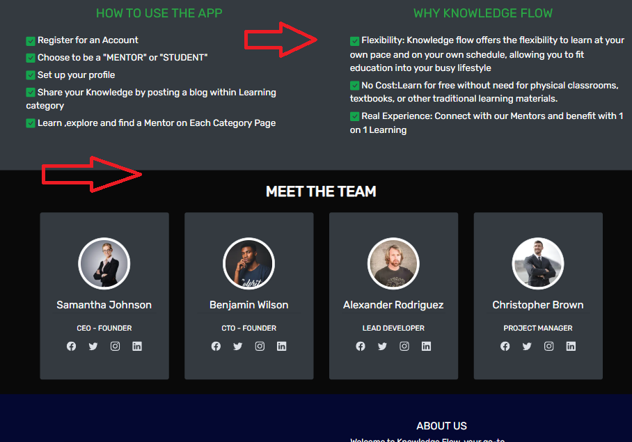

# TESTING

## Manual testing of user stories
***
WAS = Works as expected

0. As a user I want to navigation to be intuitive and user-friendly so that Im able to easily navigate through the app content.

**Step** | **Expected Result** | **Actual Result**
------------ | ------------ | ------------ |
Navigating to :https://knowledge-flow.herokuapp.com/ | home page loads | WAS |
User scrolls through the home page | Content of the page is presented | WAS |
User click on a Link in the nav bar | user taken to desired part of the web app | WAS |

 

Screenshot

1. As a user I want to know Important info on what the app is about so that I can use it's functionality on mutual benefit

**Step** | **Expected Result** | **Actual Result**
------------ | ------------ | ------------ |
Navigating to :https://knowledge-flow.herokuapp.com/ | home page loads | WAS |
User scrolls through the home page | Content of the page is presented | WAS |

 

Screenshot

3. As an authenticated user I would like to have a full access to the content of an web app

**Step** | **Expected Result** | **Actual Result**
------------ | ------------ | ------------ |
User navigates to a "Register" link in a nav bar | Loads register form | WAS |
User is filling out form correctly| Home page loads with success message | WAS |
User navigates to a "Login" link in a nav bar | Loads Login form | WAS |
User is filling out form correctly| Home page loads with success message | WAS |
User clicks on a link in the nav bar |user taken to desired part of the web app  | WAS |

 

Screenshot

4. As an authenticated user I would like a functionality to create profile(account)

**Step** | **Expected Result** | **Actual Result**
------------ | ------------ | ------------ |
Navigate to register link on a navbar| registration form loads | WAS |
Fill out registration form with all required data|form submmited with succes message  | WAS |
click on desired profile role|choose role page  displayed with 2 options   | WAS |
Inputing required data into a create profile form| form is submited with a success message that profile is created | WAS |

Screenshot

5. As an authenticated user I would like functionality to upload a supporting image to my profile and change it when I desire

**Step** | **Expected Result** | **Actual Result**
------------ | ------------ | ------------ |
Click on the choose file button | window with local files open so file can be uploaded after successful upload succes message is rendered | WAS |
 T| T | WAS |

 

Screenshot

6. As an authenticated user I would like a functionality to update or delete profile (account) if not planning to use web app anymore

**Step** | **Expected Result** | **Actual Result**
------------ | ------------ | ------------ |
navigte to a profile link in the nav bar | profile page loads | WAS |
click on update profile button| update profile form is displayed | WAS |
 click on any field change the data and click updaate profile | user redirected to profile page with successs message that profile is updated   | WAS |
 click on delete profile|delete profile page loads  | WAS |
 click on delete button| user is redirected to home page and his profile deleted | WAS |

 

Screenshot

7. As an authenticated user I would like functionality to pick different types of learning categories in my profile and change them later

**Step** | **Expected Result** | **Actual Result**
------------ | ------------ | ------------ |
navigte to a profile link in the nav bar | profile page loads | WAS |
click on update profile button| update profile form is displayed | WAS |
click on category to tick the multiple selection box if category is to be added or click on ticked box for category to be removed|depending on action user is redirected to profile page and category is set  | WAS |

 

Screenshot

8. As an authenticated user I would like functionality to see and read blog posts that other users created

**Step** | **Expected Result** | **Actual Result**
------------ | ------------ | ------------ |
Navigate to a blog link in the nav bar or click "SEE BLOGS" in the hero section| Loads blogs page | WAS |
click on a blog title or "Read the blog" button| blog detail page is loaded | WAS |

Screenshot

9. As an authenticated user I would like to upload a blog in a selected category so that I can share my knowledge,opinion and informations

**Step** | **Expected Result** | **Actual Result**
------------ | ------------ | ------------ |
Navigate to "Add Blog" link in the nav bar and click on it |The "Create Blog" form is loaded| WAS |
Enter relevant data for posting the blog| Form is populated with user data | WAS |
From the drop-down category menu, select category |Categories that are chosen during the profile set up are displayed in the drop-down menu  | WAS |
 Click the "Post" button|user is redirected to blog page with success message that "YOU ADDED A NEW BLOG" | WAS |

 

Screenshot

10. As an authenticated user I would like functionality to delete or update my blog post i I find it no longer relevant

**Step** | **Expected Result** | **Actual Result**
------------ | ------------ | ------------ |
Navigate to "Blog" link in the nav bar and click on it |page with latest blogs is loaded| WAS |
Find the blog you want to update and click on update(pencil) icon |Blog form with blog data is displayed | WAS |
Enter new relevant data for your blog and press "Post" button |blog page loads with success message and your blog is updated  | WAS |
Navigate to "Blog" link in the nav bar and click on it |page with latest blogs is loaded| WAS |
Find the blog you want to delete and click on delete(trash-can) icon |pop up modal shows and asking user to confirm that he wants to delete blog | WAS |
Press "delete" button|blogs page loads with success message"your blog post is deleted | WAS |

 

Screenshot

11. As an authenticated user I would like functionality to leave a comment on a blog post

**Step** | **Expected Result** | **Actual Result**
------------ | ------------ | ------------ |
Navigate to a blog link in the nav bar or click "SEE BLOGS" in the hero section| Loads blogs page | WAS |
click on a blog title or read the blog button| blog detail page is loaded | WAS |
scroll to the end of a blog | comment section is displayed | WAS |
enter your comment text and press green button|success message is displayed and you can see your comment in comment section  | WAS |

 

Screenshot

12. As an authenticated user I would like functionality to support my blog post with a cover image and change it later if needed.

**Step** | **Expected Result** | **Actual Result**
------------ | ------------ | ------------ |
Navigate to "Add Blog" link in the nav bar and click on it |The "Create Blog" form is loaded| WAS |
Enter relevant data for posting the blog| Form is populated with user data | WAS |
From the drop-down category menu, select category |Categories that are chosen during the profile set up are displayed in the drop-down menu  | WAS |
Click "Choose file" under image section of blog form |window with local files is displayed  | WAS |
Click on image you want to be the blog cover image |name of the image is displayed in the image section  | WAS |
 Click the "Post" button|user is redirected to blog page with success message that "YOU ADDED A NEW BLOG" | WAS |

 

Screenshot

13. As an authenticated user I would like the functionality for each category page to have a list of mentors avaliable and their contact info

**Step** | **Expected Result** | **Actual Result**
------------ | ------------ | ------------ |
Navigate to "Learning categories" link in the nav bar and click on it| dropdown menu is displayed | WAS |
Click on a category you want to display|Selected category page is displayed | WAS |
Navigate to a "mentors available section"|  | WAS |
 |  | WAS |
 |  | WAS |
 |  | WAS |

 

Screenshot

13. I want to prepare a plan for multiple weeks in advance

**Step** | **Expected Result** | **Actual Result**
------------ | ------------ | ------------ |
Register or log in to the account to be able to create a plan | Loads planner page | WAS |
 T| T | WAS |
 |  | WAS |
 |  | WAS |
 |  | WAS |
 |  | WAS |

 

Screenshot

14. I want to prepare a plan for multiple weeks in advance

**Step** | **Expected Result** | **Actual Result**
------------ | ------------ | ------------ |
Register or log in to the account to be able to create a plan | Loads planner page | WAS |
 T| T | WAS |
 |  | WAS |
 |  | WAS |
 |  | WAS |
 |  | WAS |

 

Screenshot

15. I want to prepare a plan for multiple weeks in advance

**Step** | **Expected Result** | **Actual Result**
------------ | ------------ | ------------ |
Register or log in to the account to be able to create a plan | Loads planner page | WAS |
 T| T | WAS |
 |  | WAS |
 |  | WAS |
 |  | WAS |
 |  | WAS |

 

Screenshot

16. I want to prepare a plan for multiple weeks in advance

**Step** | **Expected Result** | **Actual Result**
------------ | ------------ | ------------ |
Register or log in to the account to be able to create a plan | Loads planner page | WAS |
 T| T | WAS |
 |  | WAS |
 |  | WAS |
 |  | WAS |
 |  | WAS |

 

Screenshot

17. I want to prepare a plan for multiple weeks in advance

**Step** | **Expected Result** | **Actual Result**
------------ | ------------ | ------------ |
Register or log in to the account to be able to create a plan | Loads planner page | WAS |
 T| T | WAS |
 |  | WAS |
 |  | WAS |
 |  | WAS |
 |  | WAS |

 

Screenshot

18. I want to prepare a plan for multiple weeks in advance

**Step** | **Expected Result** | **Actual Result**
------------ | ------------ | ------------ |
Register or log in to the account to be able to create a plan | Loads planner page | WAS |
 T| T | WAS |
 |  | WAS |
 |  | WAS |
 |  | WAS |
 |  | WAS |

 

Screenshot

19. I want to prepare a plan for multiple weeks in advance

**Step** | **Expected Result** | **Actual Result**
------------ | ------------ | ------------ |
Register or log in to the account to be able to create a plan | Loads planner page | WAS |
 T| T | WAS |
 |  | WAS |
 |  | WAS |
 |  | WAS |
 |  | WAS |

 

Screenshot

20. I want to prepare a plan for multiple weeks in advance

**Step** | **Expected Result** | **Actual Result**
------------ | ------------ | ------------ |
Register or log in to the account to be able to create a plan | Loads planner page | WAS |
 T| T | WAS |
 |  | WAS |
 |  | WAS |
 |  | WAS |
 |  | WAS |

 

Screenshot

21. I want to prepare a plan for multiple weeks in advance

**Step** | **Expected Result** | **Actual Result**
------------ | ------------ | ------------ |
Register or log in to the account to be able to create a plan | Loads planner page | WAS |
 T| T | WAS |
 |  | WAS |
 |  | WAS |
 |  | WAS |
 |  | WAS |

 

Screenshot

22. I want to prepare a plan for multiple weeks in advance

**Step** | **Expected Result** | **Actual Result**
------------ | ------------ | ------------ |
Register or log in to the account to be able to create a plan | Loads planner page | WAS |
 T| T | WAS |
 |  | WAS |
 |  | WAS |
 |  | WAS |
 |  | WAS |

 

Screenshot

23. I want to prepare a plan for multiple weeks in advance

**Step** | **Expected Result** | **Actual Result**
------------ | ------------ | ------------ |
Register or log in to the account to be able to create a plan | Loads planner page | WAS |
 T| T | WAS |
 |  | WAS |
 |  | WAS |
 |  | WAS |
 |  | WAS |

 

Screenshot

24. I want to prepare a plan for multiple weeks in advance

**Step** | **Expected Result** | **Actual Result**
------------ | ------------ | ------------ |
Register or log in to the account to be able to create a plan | Loads planner page | WAS |
 T| T | WAS |
 |  | WAS |
 |  | WAS |
 |  | WAS |
 |  | WAS |

 

Screenshot

25. I want to prepare a plan for multiple weeks in advance

**Step** | **Expected Result** | **Actual Result**
------------ | ------------ | ------------ |
Register or log in to the account to be able to create a plan | Loads planner page | WAS |
 T| T | WAS |
 |  | WAS |
 |  | WAS |
 |  | WAS |
 |  | WAS |

 

Screenshot

