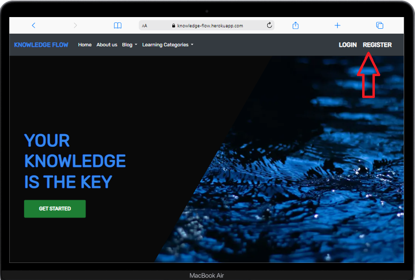
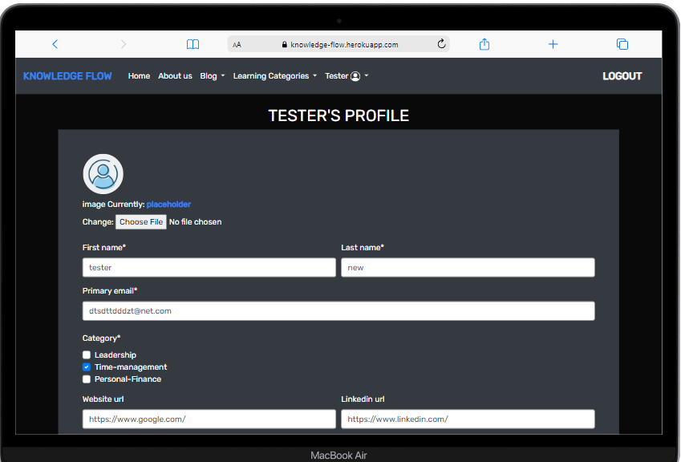

# TESTING

## Table of Contents

1. [Device Testing](#device-testing)
2. [Browser Compatibility](#browser-compatibility)
3. [Manual Testing](#manual-testing-of-user-stories)
4. [Automated Testing](#automated-testing)

***
## Device testing

## Browser compatibility

## Manual testing of user stories
***
WAS = Works as expected

0. As a user I want to navigation to be intuitive and user-friendly so that Im able to easily navigate through the app content.

**Step** | **Expected Result** | **Actual Result**
------------ | ------------ | ------------ |
Navigating to :https://knowledge-flow.herokuapp.com/ | home page loads | WAS |
User scrolls through the home page | Content of the page is presented | WAS |
User click on a Link in the nav bar | user taken to desired part of the web app | WAS |

 

Screenshot

1. As a user I want to know Important info on what the app is about so that I can use it's functionality on mutual benefit

**Step** | **Expected Result** | **Actual Result**
------------ | ------------ | ------------ |
Navigating to :https://knowledge-flow.herokuapp.com/ | home page loads | WAS |
User scrolls through the home page | Content of the page is presented | WAS |

 

Screenshot

2. As an authenticated user I would like to be able to choose a way to get benefit from the app with choosing the right role

**Step** | **Expected Result** | **Actual Result**
------------ | ------------ | ------------ |
User navigates to a "Register" link in a nav bar | Loads register form | WAS |
User is filling out form correctly| set role page loads with success message | WAS |
User reads brief info about 2 roles presented and clicks on "Mentor" button | Set profile page is loaded anduser profile role is set as "Mentor"  | WAS |
after setting up profile user clicks "set profile" button  |User email is available on a category page for student users to see along with website and linkedIn url if they have been set  | WAS |
User reads brief info about 2 roles presented and clicks on "Student" button | Set profile page is loaded anduser profile role is set as "Student"  | WAS |

 

Screenshots

3. As an authenticated user I would like to have a full access to the content of an web app

**Step** | **Expected Result** | **Actual Result**
------------ | ------------ | ------------ |
User navigates to a "Register" link in a nav bar | Loads register form | WAS |
User is filling out form correctly| Home page loads with success message | WAS |
User navigates to a "Login" link in a nav bar | Loads Login form | WAS |
User is filling out form correctly| Home page loads with success message | WAS |
User clicks on a link in the nav bar |user taken to desired part of the web app  | WAS |

 

Screenshots

4. As an authenticated user I would like a functionality to create profile(account)

**Step** | **Expected Result** | **Actual Result**
------------ | ------------ | ------------ |
Navigate to register link on a navbar| registration form loads | WAS |
Fill out registration form with all required data|form submmited with succes message  | WAS |
Click on desired profile role|choose role page  displayed with 2 options   | WAS |
Inputing required data into a create profile form| form is submited with a success message that profile is created | WAS |

Screenshots

5. As an authenticated user I would like functionality to upload a supporting image to my profile and change it when I desire

**Step** | **Expected Result** | **Actual Result**
------------ | ------------ | ------------ |
Navigate to "profile" link in the nav bar| loads profile page | WAS |
Click "update profile" button| loads profile form | WAS |
Click on the choose file button | window with local files open so file can be uploaded after successful upload succes message is rendered | WAS |
 

 

Screenshots

6. As an authenticated user I would like a functionality to update or delete profile (account) if not planning to use web app anymore

**Step** | **Expected Result** | **Actual Result**
------------ | ------------ | ------------ |
Navigte to a profile link in the nav bar | profile page loads | WAS |
Click on update profile button| update profile form is displayed | WAS |
Click on any field change the data and click updaate profile | user redirected to profile page with successs message that profile is updated   | WAS |
Click on delete profile|delete profile page loads  | WAS |
Click on delete button| user is redirected to home page and his profile deleted | WAS |

 

Screenshot

7. As an authenticated user I would like functionality to pick different types of learning categories in my profile and change them later

**Step** | **Expected Result** | **Actual Result**
------------ | ------------ | ------------ |
Navigte to a profile link in the nav bar | profile page loads | WAS |
Click on update profile button| update profile form is displayed | WAS |
Click on category to tick the multiple selection box if category is to be added or click on ticked box for category to be removed|depending on action user is redirected to profile page and category is set  | WAS |

 

Screenshot

8. As an authenticated user I would like functionality to see and read blog posts that other users created

**Step** | **Expected Result** | **Actual Result**
------------ | ------------ | ------------ |
Navigate to a blog link in the nav bar or click "SEE BLOGS" in the hero section| Loads blogs page | WAS |
Click on a blog title or "Read the blog" button| blog detail page is loaded | WAS |

Screenshot

9. As an authenticated user I would like to upload a blog in a selected category so that I can share my knowledge,opinion and informations

**Step** | **Expected Result** | **Actual Result**
------------ | ------------ | ------------ |
Navigate to "Add Blog" link in the nav bar and click on it |The "Create Blog" form is loaded| WAS |
Enter relevant data for posting the blog| Form is populated with user data | WAS |
From the drop-down category menu, select category |Categories that are chosen during the profile set up are displayed in the drop-down menu  | WAS |
 Click the "Post" button|user is redirected to blog page with success message that "YOU ADDED A NEW BLOG" | WAS |

 

Screenshot

10. As an authenticated user I would like functionality to delete or update my blog post i I find it no longer relevant

**Step** | **Expected Result** | **Actual Result**
------------ | ------------ | ------------ |
Navigate to "Blog" link in the nav bar and click on it |page with latest blogs is loaded| WAS |
Find the blog you want to update and click on update(pencil) icon |Blog form with blog data is displayed | WAS |
Enter new relevant data for your blog and press "Post" button |blog page loads with success message and your blog is updated  | WAS |
Navigate to "Blog" link in the nav bar and click on it |page with latest blogs is loaded| WAS |
Find the blog you want to delete and click on delete(trash-can) icon |pop up modal shows and asking user to confirm that he wants to delete blog | WAS |
Press "delete" button|blogs page loads with success message"your blog post is deleted | WAS |

 

Screenshot

11. As an authenticated user I would like functionality to leave a comment on a blog post

**Step** | **Expected Result** | **Actual Result**
------------ | ------------ | ------------ |
Navigate to a blog link in the nav bar or click "SEE BLOGS" in the hero section| Loads blogs page | WAS |
click on a blog title or read the blog button| blog detail page is loaded | WAS |
scroll to the end of a blog | comment section is displayed | WAS |
enter your comment text and press green button|success message is displayed and you can see your comment in comment section  | WAS |

 

Screenshot

12. As an authenticated user I would like functionality to support my blog post with a cover image and change it later if needed.

**Step** | **Expected Result** | **Actual Result**
------------ | ------------ | ------------ |
Navigate to "Add Blog" link in the nav bar and click on it |The "Create Blog" form is loaded| WAS |
Enter relevant data for posting the blog| Form is populated with user data | WAS |
From the drop-down category menu, select category |Categories that are chosen during the profile set up are displayed in the drop-down menu  | WAS |
Click "Choose file" under image section of blog form |window with local files is displayed  | WAS |
Click on image you want to be the blog cover image |name of the image is displayed in the image section  | WAS |
 Click the "Post" button|user is redirected to blog page with success message that "YOU ADDED A NEW BLOG" | WAS |

 

Screenshot

13. As an authenticated user I would like the functionality for each category page to have a list of mentors avaliable and their contact info

**Step** | **Expected Result** | **Actual Result**
------------ | ------------ | ------------ |
Navigate to "Learning categories" link in the nav bar and click on it| dropdown menu is displayed | WAS |
Click on a category you want to display|Selected category page is displayed | WAS |
Navigate to a "mentors available section" click on it|cards with available mentors is displayed   | WAS |

 

Screenshot

14. As a user I would like web app to be fully responsive and to have the same experience when using on any device

**Step** | **Expected Result** | **Actual Result**
------------ | ------------ | ------------ |
Change device screen size using chrome dev tools |Web app ux and designs remains consistent on various screen sizes | WAS |
Change device with any extension(mobile simulaor) that simulates devices screes| Web app ux and designs remains consistent on various screen sizes| WAS |

 

Screenshot

15. As an returning user user I would like functionality to set a new password if I forgot the password so that I can still use the web app

**Step** | **Expected Result** | **Actual Result**
------------ | ------------ | ------------ |
User navigates to a "Login" link in a nav bar | Loads Login form | WAS |
Click on a "forgot password" link at the bottom of the form| password reset page loads| WAS |
Enter the valid email address that was used in setting up the profile and press "reset my password"|password reset done page is displayed and email with reset link is sent  | WAS |
Open your email inbox and reset password mail with a link should be there|link takes user through a process of setting a new pasword  | WAS |

 

Screenshot

16. As a User I would like a Functionality to contact the app owner or a team so that I can leave a suggestion or express my opinion about the web app

**Step** | **Expected Result** | **Actual Result**
------------ | ------------ | ------------ |
User navigates to a "Register" link in a nav bar | Loads register form | WAS |
User is filling out form correctly| Home page loads with success message | WAS |
User navigates to a "Login" link in a nav bar | Loads Login form | WAS |
User is filling out form correctly| Home page loads with success message | WAS |
Navigate to "About us" link in a navbar | Page scrolls to about section with a form | WAS |
Scroll to the "About us" section of the page| Contact form is displayed | WAS |
User is filling out form correctly and pressing "Send" button|User taken to top of the page and succes message"Thank you for your message" is displayed  | WAS |

 

Screenshot

17. As a user I would like a Functionality to update or delete a comment I posted to a blogpost so that if any mistake was made or new information is acquired anyone reading will be up to date

**Step** | **Expected Result** | **Actual Result**
------------ | ------------ | ------------ |
Navigate to a "blog" link in the nav bar or click "SEE BLOGS" in the hero section| Loads blogs page | WAS | 
Click on a blog title or "Read The blog" button of a blog that the comment is posted for| Blog detail page is loaded | WAS |
Scroll to comment you posted ad to update click on a "pencil" button | Update comment page loads  | WAS |
Click on the comment field update the comment and press "update " button  | comment is updated and success message is displayed  | WAS |
 Click on a "trash" button to delete comment and in a pop up modal press "delete"| delete modal pops up and after delete is pressed comment is deleted with a success message  | WAS |
 

 

Screenshot

18. As a site owner I want to restrict access to sections of an app to unauthenticated users so that basic standards of data protection are met

**Step** | **Expected Result** | **Actual Result**
------------ | ------------ | ------------ |
Not logged in user Clicks on "Learning category" link | dropdown with categories is displayed | WAS |
Not logged in user Clicks on any category | Login page loads | WAS |
Not logged in user Clicks on a "Blogs" link in a navbar | Blog page loads  | WAS |
Not logged in user Clicks on a title or "Read The blog" button |Login page loads  | WAS |
Not logged in user scrolls to a contact form and after filling it out clicks a "send" button | user taken to top of the page with a warnning message "needs to be logged in to send message"  | WAS |

 

Screenshot

19. As a Site Owner I would like that authenticated users have full access to web app and its functionality

**Step** | **Expected Result** | **Actual Result**
------------ | ------------ | ------------ |
Navigate to "About us" link in a navbar | Page scrolls to about section with a form | WAS |
Scroll to the "About us" section of the page| Contact form is displayed | WAS |
User is filling out form correctly and pressing "Send" button|User taken to top of the page and succes message"Thank you for your message" is displayed  | WAS |
Navigate to "Add Blog" link in the nav bar and click on it |The "Create Blog" form is loaded| WAS |
Enter relevant data for posting the blog| Form is populated with user data | WAS |
From the drop-down category menu, select category |Categories that are chosen during the profile set up are displayed in the drop-down menu  | WAS |
 Click the "Post" button|user is redirected to blog page with success message that "YOU ADDED A NEW BLOG" | WAS |

 

Screenshot

20. As a Site Owner I would like that each data entry is validated before stored in database

**Step** | **Expected Result** | **Actual Result**
------------ | ------------ | ------------ |
Navigte to a profile link in the nav bar | profile page loads | WAS |
Click on update profile button| update profile form is displayed | WAS |
Fill clear any fiel except website and linkedIn url fields and press update | form error message is displayed "please fill out this field"   | WAS |
Navigate to "Add Blog" link in the nav bar and click on it |The "Create Blog" form is loaded| WAS |
Enter relevant data for posting the blog but dont add category| Form is populated with user data | WAS |
click "post" button | message is displayed to select the item from the list and blog is not posted | WAS |
 |  | WAS |

 

Screenshot

21. As a Site Owner I would like that users an leave a message or feedback via contact form or

**Step** | **Expected Result** | **Actual Result**
------------ | ------------ | ------------ |
User navigates to a "Register" link in a nav bar | Loads register form | WAS |
User is filling out form correctly| Home page loads with success message | WAS |
User navigates to a "Login" link in a nav bar | Loads Login form | WAS |
User is filling out form correctly| Home page loads with success message | WAS |
Navigate to "About us" link in a navbar | Page scrolls to about section with a form | WAS |
Scroll to the "About us" section of the page| Contact form is displayed | WAS |
User is filling out form correctly and pressing "Send" button|User taken to top of the page and succes message"Thank you for your message" is displayed  | WAS |

 

Screenshot

22. As a Site Owner I would like that users have more than one way of comunicating with team or     myself
    - NOTE: SINCE THIS IS THE PROJECT FOR EDUCATIONAL PURPOSES AT THE MOMENT LINKS IN TEAM SECTION
    ARE TAKING USER TO A LOGIN SOCIAL MEDIA PAGE(NOT ACTUAL TEAM MEMMBER PAGE)

**Step** | **Expected Result** | **Actual Result**
------------ | ------------ | ------------ |
User scrolls to the bottom of the website| website footer is presented | WAS |
User clicks on a github icon| site owner github page opens in a new window | WAS |
User scrolls to the bottom of the website| website footer is presented | WAS |
User clicks on a LinkedIn icon |site owner LinkedIn page opens in a new window  | WAS |
User scrolls to the team section  and click on any social media icon on a team member card | Social media page of a team member opens  | WAS |
 |  | WAS |

 

Screenshot

23. As a Site Owner I would like that each 'Mentor' user cant see himself on the list of available mentors for his respective category(user wont be contacting himself)

**Step** | **Expected Result** | **Actual Result**
------------ | ------------ | ------------ |
User navigates to a "Register" link in a nav bar | Loads register form | WAS |
User is filling out form correctly| set role page loads with success message | WAS |
User reads brief info about 2 roles presented and clicks on "Mentor" button | Set profile page is loaded anduser profile role is set as "Mentor"  | WAS |
after setting up profile user clicks "set profile" button  |User email is available on a category page for student users to see along with website and linkedIn url if they have been set  | WAS |
User navigates to his Learning category page (selected in profile) and clicks on available mentors link | Users data is not displayed to himself | WAS |
 |  | WAS |
 |  | WAS |
 |  | WAS |

 

Screenshot

23. I want to prepare a plan for multiple weeks in advance

**Step** | **Expected Result** | **Actual Result**
------------ | ------------ | ------------ |
Register or log in to the account to be able to create a plan | Loads planner page | WAS |
 T| T | WAS |
 |  | WAS |
 |  | WAS |
 |  | WAS |
 |  | WAS |

 

Screenshot

25. I want to prepare a plan for multiple weeks in advance

**Step** | **Expected Result** | **Actual Result**
------------ | ------------ | ------------ |
Register or log in to the account to be able to create a plan | Loads planner page | WAS |
 T| T | WAS |
 |  | WAS |
 |  | WAS |
 |  | WAS |
 |  | WAS |

 

Screenshot

25. As a Site Owner I would like that each authenticated user has option to get access to an app if he forgots password for any reason via (Reset password functionality)

**Step** | **Expected Result** | **Actual Result**
------------ | ------------ | ------------ |
User navigates to a "Login" link in a nav bar | Loads Login form | WAS |
Click on a "forgot password" link at the bottom of the form| password reset page loads| WAS |
Enter the valid email address that was used in setting up the profile and press "reset my password"|password reset done page is displayed and email with reset link is sent  | WAS |
Open your email inbox and reset password mail with a link should be there|link takes user through a process of setting a new pasword  | WAS |

 

Screenshot

## Automated testing